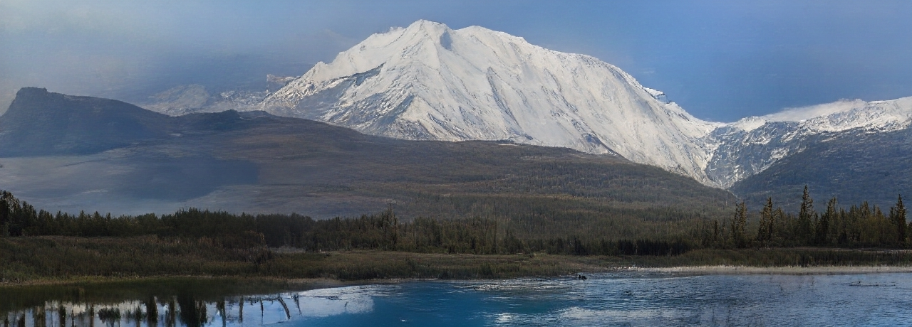
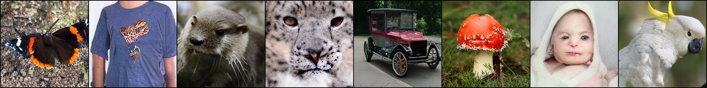
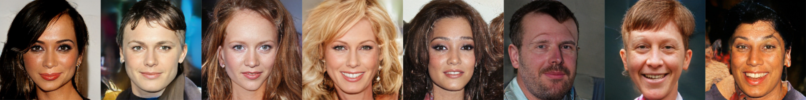
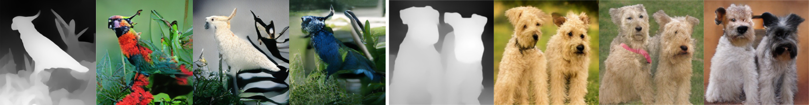
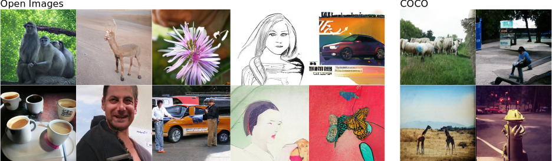

# Taming Transformers for High-Resolution Image Synthesis
##### CVPR 2021 (Oral)


[**Taming Transformers for High-Resolution Image Synthesis**](https://compvis.github.io/taming-transformers/)<br/>
[Patrick Esser](https://github.com/pesser)\*,
[Robin Rombach](https://github.com/rromb)\*,
[Björn Ommer](https://hci.iwr.uni-heidelberg.de/Staff/bommer)<br/>
\* equal contribution


## Initial Note
This repo is forked and utilized for the BLG-561E project. I didn't contribute to the codebase. I followed the guidance of the original repo completely. The two notebooks I mainly used can be found under the notebooks folder. The following sections contain some cut out portions of the original readme.


## Requirements
A suitable [conda](https://conda.io/) environment named `taming` can be created
and activated with:

```
conda env create -f environment.yaml
conda activate taming
```

## Running pretrained models

The commands below will start a streamlit demo which supports sampling at
different resolutions and image completions. To run a non-interactive version
of the sampling process, replace `streamlit run scripts/sample_conditional.py --`
by `python scripts/make_samples.py --outdir <path_to_write_samples_to>` and
keep the remaining command line arguments. 

To sample from unconditional or class-conditional models, 
run `python scripts/sample_fast.py -r <path/to/config_and_checkpoint>`.
We describe below how to use this script to sample from the ImageNet, FFHQ, and CelebA-HQ models, 
respectively.

### S-FLCKR


You can also [run this model in a Colab
notebook](https://colab.research.google.com/github/CompVis/taming-transformers/blob/master/scripts/taming-transformers.ipynb),
which includes all necessary steps to start sampling.

Download the
[2020-11-09T13-31-51_sflckr](https://heibox.uni-heidelberg.de/d/73487ab6e5314cb5adba/)
folder and place it into `logs`. Then, run
```
streamlit run scripts/sample_conditional.py -- -r logs/2020-11-09T13-31-51_sflckr/
```

### ImageNet


Download the [2021-04-03T19-39-50_cin_transformer](https://k00.fr/s511rwcv)
folder and place it into logs.  Sampling from the class-conditional ImageNet
model does not require any data preparation. To produce 50 samples for each of
the 1000 classes of ImageNet, with k=600 for top-k sampling, p=0.92 for nucleus
sampling and temperature t=1.0, run

```
python scripts/sample_fast.py -r logs/2021-04-03T19-39-50_cin_transformer/ -n 50 -k 600 -t 1.0 -p 0.92 --batch_size 25   
```

To restrict the model to certain classes, provide them via the `--classes` argument, separated by 
commas. For example, to sample 50 *ostriches*, *border collies* and *whiskey jugs*, run

```
python scripts/sample_fast.py -r logs/2021-04-03T19-39-50_cin_transformer/ -n 50 -k 600 -t 1.0 -p 0.92 --batch_size 25 --classes 9,232,901   
```
We recommended to experiment with the autoregressive decoding parameters (top-k, top-p and temperature) for best results.  

### FFHQ/CelebA-HQ

Download the [2021-04-23T18-19-01_ffhq_transformer](https://k00.fr/yndvfu95) and 
[2021-04-23T18-11-19_celebahq_transformer](https://k00.fr/2xkmielf) 
folders and place them into logs. 
Again, sampling from these unconditional models does not require any data preparation.
To produce 50000 samples, with k=250 for top-k sampling,
p=1.0 for nucleus sampling and temperature t=1.0, run

```
python scripts/sample_fast.py -r logs/2021-04-23T18-19-01_ffhq_transformer/   
```
for FFHQ and  

```
python scripts/sample_fast.py -r logs/2021-04-23T18-11-19_celebahq_transformer/   
```
to sample from the CelebA-HQ model.
For both models it can be advantageous to vary the top-k/top-p parameters for sampling.

### FacesHQ


Download [2020-11-13T21-41-45_faceshq_transformer](https://k00.fr/qqfl2do8) and
place it into `logs`. Follow the data preparation steps for
[CelebA-HQ](#celeba-hq) and [FFHQ](#ffhq). Run
```
streamlit run scripts/sample_conditional.py -- -r logs/2020-11-13T21-41-45_faceshq_transformer/
```

### D-RIN


Download [2020-11-20T12-54-32_drin_transformer](https://k00.fr/39jcugc5) and
place it into `logs`. To run the demo on a couple of example depth maps
included in the repository, run

```
streamlit run scripts/sample_conditional.py -- -r logs/2020-11-20T12-54-32_drin_transformer/ --ignore_base_data data="{target: main.DataModuleFromConfig, params: {batch_size: 1, validation: {target: taming.data.imagenet.DRINExamples}}}"
```

To run the demo on the complete validation set, first follow the data preparation steps for
[ImageNet](#imagenet) and then run
```
streamlit run scripts/sample_conditional.py -- -r logs/2020-11-20T12-54-32_drin_transformer/
```

### COCO
Download [2021-01-20T16-04-20_coco_transformer](https://k00.fr/2zz6i2ce) and
place it into `logs`. To run the demo on a couple of example segmentation maps
included in the repository, run

```
streamlit run scripts/sample_conditional.py -- -r logs/2021-01-20T16-04-20_coco_transformer/ --ignore_base_data data="{target: main.DataModuleFromConfig, params: {batch_size: 1, validation: {target: taming.data.coco.Examples}}}"
```

### ADE20k
Download [2020-11-20T21-45-44_ade20k_transformer](https://k00.fr/ot46cksa) and
place it into `logs`. To run the demo on a couple of example segmentation maps
included in the repository, run

```
streamlit run scripts/sample_conditional.py -- -r logs/2020-11-20T21-45-44_ade20k_transformer/ --ignore_base_data data="{target: main.DataModuleFromConfig, params: {batch_size: 1, validation: {target: taming.data.ade20k.Examples}}}"
```

## Scene Image Synthesis

Scene image generation based on bounding box conditionals as done in our CVPR2021 AI4CC workshop paper [High-Resolution Complex Scene Synthesis with Transformers](https://arxiv.org/abs/2105.06458) (see talk on [workshop page](https://visual.cs.brown.edu/workshops/aicc2021/#awards)). Supporting the datasets COCO and Open Images.


## BibTeX

```
@misc{esser2020taming,
      title={Taming Transformers for High-Resolution Image Synthesis}, 
      author={Patrick Esser and Robin Rombach and Björn Ommer},
      year={2020},
      eprint={2012.09841},
      archivePrefix={arXiv},
      primaryClass={cs.CV}
}
```
